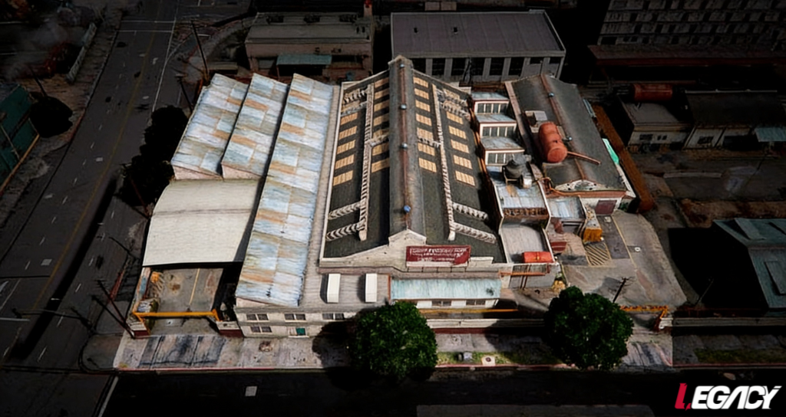
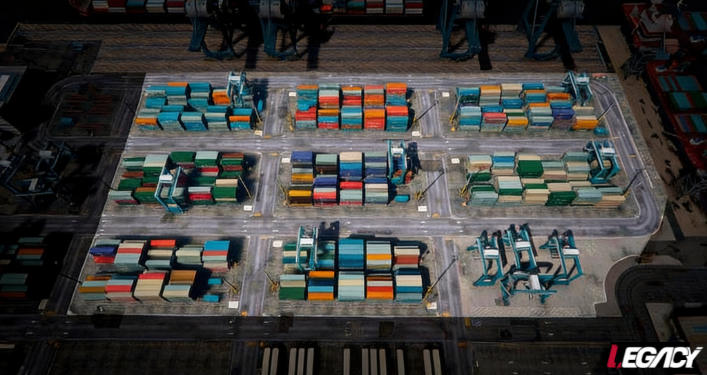
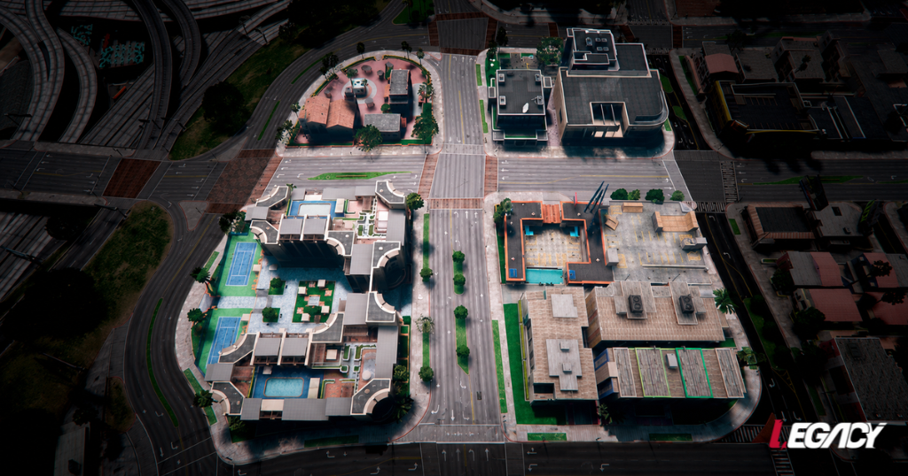
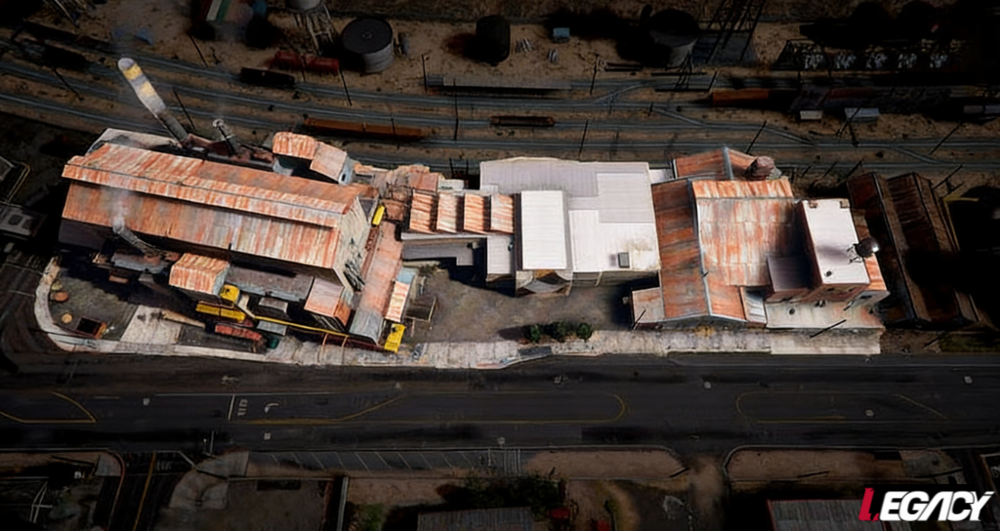
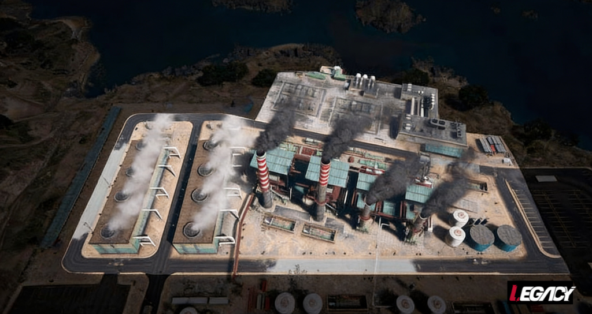
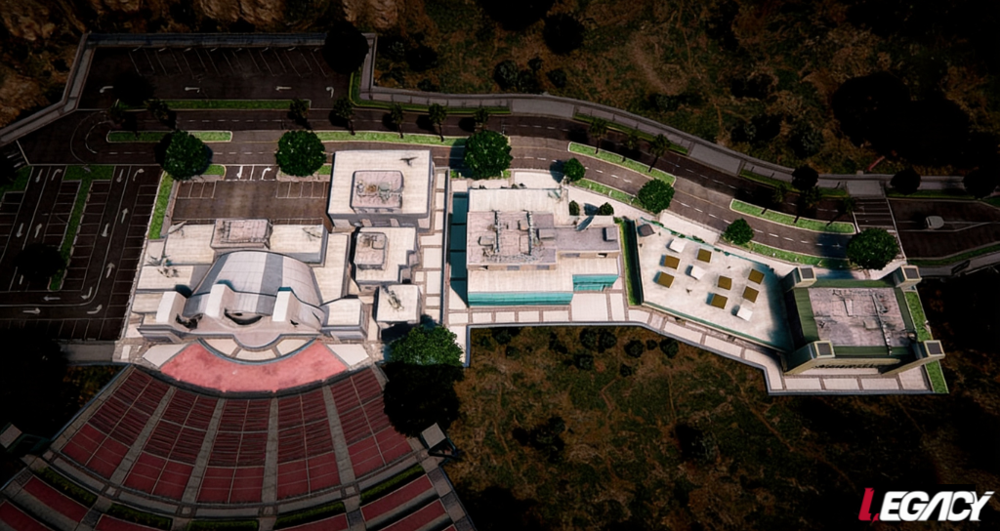

# 🔫Ações Médias

## Açougue

<mark style="background-color:$warning;">**Negociação: Inexistente**</mark>


**Regras Bandidos:** No mínimo 8 e no máximo 10 membros.

**Polícia:** No máximo 12 membros.


• Armamento: Submetralhadora.
\
• Smoke: 3 (máximo)
\
• Teti-Chão: Não. É proibido subir no telhado do açougue.


**Reféns: Não permitido.**

**É proibido realizar a ação no modo de fuga.**

É proibido marcar o drop policial.

O perímetro delimitado deve ser rigorosamente respeitado.


<mark style="color:$warning;">É obrigatório aguardar a polícia por 40 minutos e, após o envio do QTI, é obrigatório permanecer no local até a chegada da polícia.</mark>

<figure><figcaption></figcaption></figure>

***

## Container

<mark style="background-color:$warning;">**Negociação: Inexistente**</mark>


**Regras Bandidos:** No mínimo 8 e no máximo 10 membros.

**Polícia:** No máximo 12 membros.


• Armamento: Submetralhadora.
\
• Smoke: 3 (máximo)\
• Teti-Chão: Sim


**Reféns: Não permitido.**

**É proibido realizar a ação no modo de fuga.**

É proibido marcar o drop policial.

O perímetro delimitado deve ser rigorosamente respeitado.


<mark style="color:$warning;">É obrigatório aguardar a polícia por 40 minutos e, após o envio do QTI, é obrigatório permanecer no local até a chegada da polícia.</mark>

<figure><figcaption></figcaption></figure>

***

## Fleeca Chaves

<mark style="background-color:$warning;">**Negociação: Obrigatória.**</mark>


**Regras Bandidos:** No mínimo 6 e no máximo 8 membros.

**Polícia:** No máximo 10 membros.


• Armamento: Submetralhadora ou Fuzil
\
• Smoke: 3 (negociável)
\
• Refém: 5 (Máximo).


**É** proibido marcar o drop policial.

O perímetro delimitado deve ser rigorosamente respeitado.


#### Regras do Modo de Fuga&#x20;

> **Reféns: No máximo 5 Reféns | Fuga Limpa: Negociável.**

* [x] São necessários no mínimo 2 veículos por parte dos bandidos.
* [x] São permitidos no máximo 3 Unidades Policiais para cada veículo dos bandidos.
* [x] É obrigatório portar o armamento necessário para realizar a ação.

<mark style="color:$warning;">É obrigatório aguardar a polícia por 40 minutos e, após o envio do QTI, é obrigatório permanecer no local até a chegada da polícia.</mark>

<figure><figcaption></figcaption></figure>

***

## Fleeca Life Invader

<mark style="background-color:$warning;">**Negociação: Obrigatória.**</mark>


**Regras Bandidos:** No mínimo 6 e no máximo 8 membros.

**Polícia:** No máximo 10 membros.


• Armamento: Submetralhadora ou Fuzil
\
• Smoke: 3 (negociável)
\
• Refém: 5 (Máximo).


**É** proibido marcar o drop policial.\
É proibido utilizar o interior do Life Invader\
No máximo 3 bandidos dentro da piscina.\
O perímetro delimitado deve ser rigorosamente respeitado.


#### Regras do Modo de Fuga&#x20;

> **Reféns: No máximo 5 Reféns | Fuga Limpa: Negociável.**

* [x] São necessários no mínimo 2 veículos por parte dos bandidos.
* [x] São permitidos no máximo 3 Unidades Policiais para cada veículo dos bandidos.
* [x] É obrigatório portar o armamento necessário para realizar a ação.

<mark style="color:$warning;">É obrigatório aguardar a polícia por 40 minutos e, após o envio do QTI, é obrigatório permanecer no local até a chegada da polícia.</mark>

<figure><figcaption></figcaption></figure>

***

## Fleeca Praia

<mark style="background-color:$warning;">**Negociação: Obrigatória.**</mark>


**Regras Bandidos:** No mínimo 6 e no máximo 8 membros.

**Polícia:** No máximo 10 membros.


• Armamento: Submetralhadora ou Fuzil
\
• Smoke: 3 (negociável)
\
• Refém: 5 (Máximo).


**É** proibido marcar o drop policial.\
O perímetro delimitado deve ser rigorosamente respeitado.


#### Regras do Modo de Fuga&#x20;

> **Reféns: No máximo 5 Reféns | Fuga Limpa: Negociável.**

* [x] São necessários no mínimo 2 veículos por parte dos bandidos.
* [x] São permitidos no máximo 3 Unidades Policiais para cada veículo dos bandidos.
* [x] É obrigatório portar o armamento necessário para realizar a ação.

<mark style="color:$warning;">É obrigatório aguardar a polícia por 40 minutos e, após o envio do QTI, é obrigatório permanecer no local até a chegada da polícia.</mark>

<figure><figcaption></figcaption></figure>

***

## Fleeca Rota 68

<mark style="background-color:$warning;">**Negociação: Obrigatória.**</mark>


**Regras Bandidos:** No mínimo 6 e no máximo 8 membros.

**Polícia:** No máximo 10 membros.


• Armamento: Submetralhadora ou Fuzil
\
• Smoke: 3 (negociável)
\
• Refém: 5 (Máximo).


**É** proibido marcar o drop policial.\
O perímetro delimitado deve ser rigorosamente respeitado.


#### Regras do Modo de Fuga&#x20;

> **Reféns: No máximo 5 Reféns | Fuga Limpa: Negociável.**

* [x] São necessários no mínimo 2 veículos por parte dos bandidos.
* [x] São permitidos no máximo 3 Unidades Policiais para cada veículo dos bandidos.
* [x] É obrigatório portar o armamento necessário para realizar a ação.

<mark style="color:$warning;">É obrigatório aguardar a polícia por 40 minutos e, após o envio do QTI, é obrigatório permanecer no local até a chegada da polícia.</mark>

<figure><figcaption></figcaption></figure>

***

## Fleeca Shopping

<mark style="background-color:$warning;">**Negociação: Obrigatória.**</mark>


**Regras Bandidos:** No mínimo 6 e no máximo 8 membros.

**Polícia:** No máximo 10 membros.


• Armamento: Submetralhadora ou Fuzil
\
• Smoke: 3 (negociável)
\
• Refém: 5 (Máximo).


**É** proibido marcar o drop policial.\
O perímetro delimitado deve ser rigorosamente respeitado.


#### Regras do Modo de Fuga&#x20;

> **Reféns: No máximo 5 Reféns | Fuga Limpa: Negociável.**

* [x] São necessários no mínimo 2 veículos por parte dos bandidos.
* [x] São permitidos no máximo 3 Unidades Policiais para cada veículo dos bandidos.
* [x] É obrigatório portar o armamento necessário para realizar a ação.

<mark style="color:$warning;">É obrigatório aguardar a polícia por 40 minutos e, após o envio do QTI, é obrigatório permanecer no local até a chegada da polícia.</mark>

<figure><figcaption></figcaption></figure>

***

## Galinheiro

<mark style="background-color:$warning;">**Negociação: Inexistente.**</mark>


**Regras Bandidos:** No mínimo 8 e no máximo 10 membros.

**Polícia:** No máximo 12 membros.


• Armamento: Submetralhadora.
\
• Smoke: 3 (máximo)\
• **Teti-Chão: Não. É proibido subir no telhado do galinheiro.**


**Reféns: Não permitido.**

**É proibido realizar a ação no modo de fuga.**

É proibido marcar o drop policial.

O perímetro delimitado deve ser rigorosamente respeitado.


<mark style="color:$warning;">É obrigatório aguardar a polícia por 40 minutos e, após o envio do QTI, é obrigatório permanecer no local até a chegada da polícia.</mark>

<figure><figcaption></figcaption></figure>

***

## Joalheria

<mark style="background-color:$warning;">**Negociação: Obrigatória.**</mark>


**Regras Bandidos:** No mínimo 6 e no máximo 8 membros.

_São permitidos no máximo 3 bandidos fora da Joalheria._

**Polícia**: No máximo 10 membros.


• Armamento: Submetralhadora \
• Smoke: 3 (negociável)
\
• Refém: 5 (Máximo)


**É** proibido marcar o drop policial.\
É proibido utilizar o interior da loja de Peds.\
É proibido utilizar o interior do Jurídico.\
Só é permitido sair da joalheria após 5 minutos que o balão do ínicio da ação cair.\
O perímetro delimitado deve ser rigorosamente respeitado.


#### Regras do Modo de Fuga&#x20;

> **Reféns: No máximo 5 Reféns | Fuga Limpa: Negociável.**

* [x] São necessários no mínimo 2 veículos por parte dos bandidos.
* [x] São permitidos no máximo 3 Unidades Policiais para cada veículo dos bandidos.
* [x] É obrigatório portar o armamento necessário para realizar a ação.

<mark style="color:$warning;">É obrigatório aguardar a polícia por 40 minutos e, após o envio do QTI, é obrigatório permanecer no local até a chegada da polícia.</mark>

<figure><figcaption></figcaption></figure>

***

## Mergulhador

<mark style="background-color:$warning;">**Negociação: Inexistente.**</mark>


**Regras Bandidos:** 8 Membros\
**Polícia:** 10 Membros.


• Armamento: Pistola
\
• É Proibida a utilização de Smokes\
• **Teti-Chão: Sim**


**Reféns: Não permitido.**

**É proibido realizar a ação no modo de fuga.**

É proibido marcar o drop policial.

O perímetro delimitado deve ser rigorosamente respeitado.


<mark style="color:$warning;">É obrigatório aguardar a polícia por 40 minutos e, após o envio do QTI, é obrigatório permanecer no local até a chegada da polícia.</mark>

<figure><figcaption></figcaption></figure>

***

## Observatório

<mark style="background-color:$warning;">**Negociação: Inexistente.**</mark>


**Regras Bandidos:** No mínimo 8 e no máximo 10 membros.

**Polícia:** No máximo 12 membros..


• Armamento: Pistola
\
• É Proibida a utilização de Smokes\
• **Teti-Chão: Sim**


**Reféns: Não permitido.**

**É proibido realizar a ação no modo de fuga.**

É proibido marcar o drop policial.

Só é permitido disparo nos oficiais após a ultrapassagem da faixa de pedestres.

O perímetro delimitado deve ser rigorosamente respeitado.


<mark style="color:$warning;">É obrigatório aguardar a polícia por 40 minutos e, após o envio do QTI, é obrigatório permanecer no local até a chegada da polícia.</mark>

<figure><figcaption></figcaption></figure>
