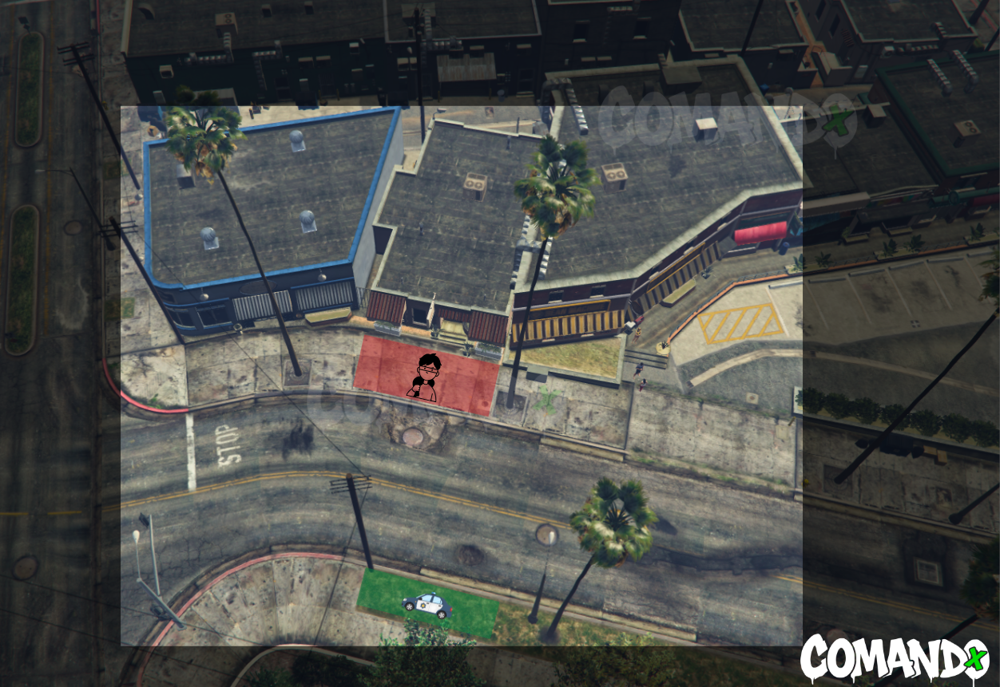
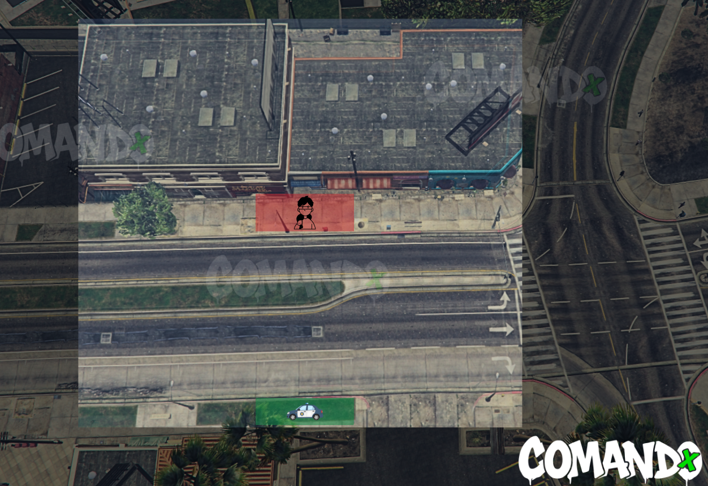
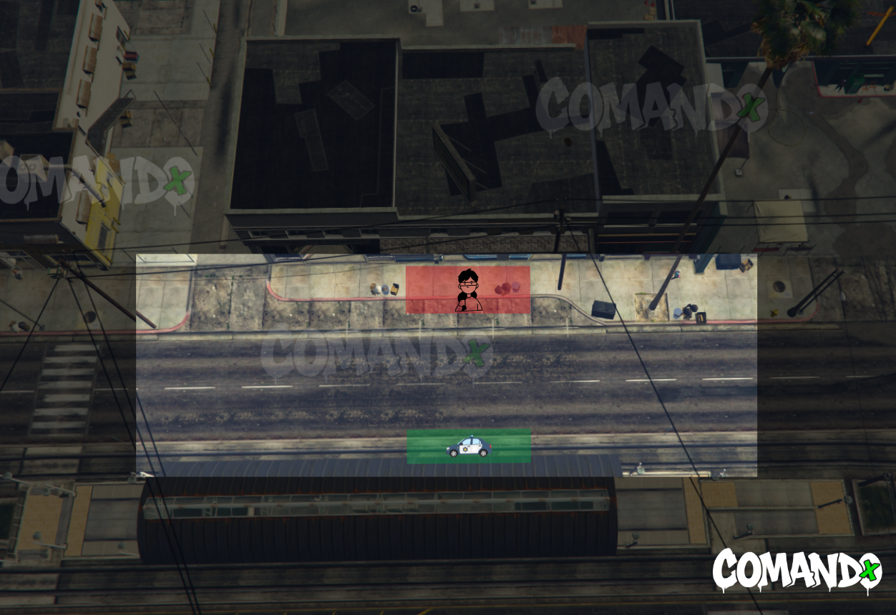

# 🔫Ações Pequenas

## Caixa Eletrônico, Corrida Ilegal e Roubo a Residência

Não é permitido nenhum tipo de resgate com armas, somente outro veículo para continuar a fuga.

Caso o veículo seja trocado, a fuga deixará de ser limpa e a polícia tem permissão para elevar o código da ação.

> <mark style="background-color:yellow;">Em caso de capotamento e que o veículo do mesmo permaneça capotado, a fuga dará continuidade "a pé", entretanto se o mesmo ainda não tiver trocado de veículo poderá ser resgatado, respeitando as OBSERVAÇÕES anteriores.</mark>

Caso o cidadão permaneça no interior do veículo capotado, o policial poderá retirar o mesmo.


**Refém: Proibido.**
\
**Armamento: Proibido.**


* [x] Negociação: Inexistente.
* [x] Bandidos: 1 Veículo cheio.
* [x] Policiais: 3 Viaturas.

***

## Aeroporto Trevor

<mark style="background-color:$warning;">**Negociação: Inexistente.**</mark>


**Regras Bandidos:** 5 membros

**Polícia:** 7 membros.


• Armamento: Pistola
\
• É Proibida a utilização de Smokes\
• **Teti-Chão: Sim**


**Reféns: Não permitido.**

**É proibido realizar a ação no modo de fuga.**

É proibido marcar o drop policial.

É obrigatório que o Drop dos policiais seja realizado na área demarcada em verde.

O perímetro delimitado deve ser rigorosamente respeitado.


<mark style="color:$warning;">É obrigatório aguardar a polícia por 30 minutos e, após o envio do QTI, é obrigatório permanecer no local até a chegada da polícia.</mark>

<figure><figcaption></figcaption></figure>

***

## Ammunation Porto

<mark style="background-color:$warning;">**Negociação: Inexistente.**</mark>


**Regras Bandidos:** Mínimo 2 e Máximo 3 membros.

**Polícia:** 4 membros.


• Armamento: Pistola
\
• É Proibida a utilização de Smokes\
• **Teti-Chão: Sim**


**Reféns: Não permitido.**

**É proibido realizar a ação no modo de fuga.**

É proibido marcar o drop policial.

O perímetro delimitado deve ser rigorosamente respeitado.


<mark style="color:$warning;">É obrigatório aguardar a polícia por 30 minutos e, após o envio do QTI, é obrigatório permanecer no local até a chegada da polícia.</mark>

<figure><figcaption></figcaption></figure>

***

## Ammunation Praça

<mark style="background-color:$warning;">**Negociação: Inexistente.**</mark>


**Regras Bandidos:** Mínimo 2 e Máximo 3 membros.

**Polícia: 4** membros.


• Armamento: Pistola
\
• É Proibida a utilização de Smokes\
• **Teti-Chão: Sim**


**Reféns: Não permitido.**

**É proibido realizar a ação no modo de fuga.**

É proibido marcar o drop policial.

O perímetro delimitado deve ser rigorosamente respeitado.


<mark style="color:$warning;">É obrigatório aguardar a polícia por 30 minutos e, após o envio do QTI, é obrigatório permanecer no local até a chegada da polícia.</mark>

<figure><figcaption></figcaption></figure>

***

## Antena

<mark style="background-color:$warning;">**Negociação: Inexistente.**</mark>


**Regras Bandidos:** 3 membros.

**Polícia: 5** membros.


• Armamento: Pistola
\
• É Proibida a utilização de Smokes\
• **Teti-Chão: Sim**


**Reféns: Não permitido.**

**É proibido realizar a ação no modo de fuga.**

É proibido marcar o drop policial.

O perímetro delimitado deve ser rigorosamente respeitado.


<mark style="color:$warning;">É obrigatório aguardar a polícia por 30 minutos e, após o envio do QTI, é obrigatório permanecer no local até a chegada da polícia.</mark>

<figure><figcaption></figcaption></figure>

***

## Auditório

<mark style="background-color:$warning;">**Negociação: Inexistente.**</mark>


**Regras Bandidos:** 5 membros.

**Polícia: 7** membros.


• Armamento: Pistola
\
• É Proibida a utilização de Smokes\
• **Teti-Chão: Sim**


**Reféns: Não permitido.**

**É proibido realizar a ação no modo de fuga.**

É proibido marcar o drop policial.

O perímetro delimitado deve ser rigorosamente respeitado.


<mark style="color:$warning;">É obrigatório aguardar a polícia por 30 minutos e, após o envio do QTI, é obrigatório permanecer no local até a chegada da polícia.</mark>

<figure><figcaption></figcaption></figure>

***

## Bebidas Samir

<mark style="background-color:$warning;">**Negociação: Inexistente.**</mark>


**Regras Bandidos:** Mínimo 2 e Máximo 3 membros.

**Polícia: 5** membros.


• Armamento: Pistola
\
• É Proibida a utilização de Smokes\
• **Teti-Chão: Sim**


**Reféns: Não permitido.**

**É proibido realizar a ação no modo de fuga.**

É proibido marcar o drop policial.

O perímetro delimitado deve ser rigorosamente respeitado.


<mark style="color:$warning;">É obrigatório aguardar a polícia por 30 minutos e, após o envio do QTI, é obrigatório permanecer no local até a chegada da polícia.</mark>

<figure><figcaption></figcaption></figure>

***

## Comedy

<mark style="background-color:$warning;">**Negociação: Inexistente.**</mark>


**Regras Bandidos:** 5 membros.

**Polícia: 7** membros.


• Armamento: Pistola
\
• É Proibida a utilização de Smokes\
• **Teti-Chão: Sim**


**Reféns: Não permitido.**

**É proibido realizar a ação no modo de fuga.**

É proibido marcar o drop policial.

O perímetro delimitado deve ser rigorosamente respeitado.


<mark style="color:$warning;">É obrigatório aguardar a polícia por 30 minutos e, após o envio do QTI, é obrigatório permanecer no local até a chegada da polícia.</mark>

<figure><figcaption></figcaption></figure>

***

## Fast Food

<mark style="background-color:$warning;">**Negociação: Inexistente.**</mark>


**Regras Bandidos:** 2 membros.

**Polícia: 3** membros.


• Armamento: Pistola
\
• É Proibida a utilização de Smokes\
• **Teti-Chão: Sim**


**Reféns: Não permitido.**

**É proibido realizar a ação no modo de fuga.**

É proibido marcar o drop policial.

O perímetro delimitado deve ser rigorosamente respeitado.


<mark style="color:$warning;">É obrigatório aguardar a polícia por 30 minutos e, após o envio do QTI, é obrigatório permanecer no local até a chegada da polícia.</mark>

<figure><figcaption></figcaption></figure>

***

## Lojinha Banco Central

<mark style="background-color:$warning;">**Negociação: Obrigatória.**</mark>


**Regras Bandidos:** 3 membros.

**Polícia**: 4 membros.


• Armamento: Pistola\
• É Proibida a utilização de Smokes.
\
• Refém: No máximo 2 Reféns (Somente na fuga)


**É** proibido marcar o drop policial.\
O perímetro delimitado deve ser rigorosamente respeitado.


#### Regras do Modo de Fuga&#x20;

> **Reféns: No máximo 2 Reféns | Fuga Limpa: Negociável.**

* [x] São necessários no mínimo 2 veículos por parte dos bandidos.
* [x] São permitidos no máximo 3 Unidades Policiais para cada veículo dos bandidos.
* [x] É obrigatório portar o armamento necessário para realizar a ação.

<mark style="color:$warning;">É obrigatório aguardar a polícia por 30 minutos e, após o envio do QTI, é obrigatório permanecer no local até a chegada da polícia.</mark>

<figure><figcaption></figcaption></figure>

***

## Lojinha Barragem

<mark style="background-color:$warning;">**Negociação: Obrigatória.**</mark>


**Regras Bandidos:** 3 membros.

**Polícia**: 4 membros.


• Armamento: Pistola\
• É Proibida a utilização de Smokes.
\
• Refém: No máximo 2 Reféns (Somente na fuga)


**É** proibido marcar o drop policial.\
O perímetro delimitado deve ser rigorosamente respeitado.


#### Regras do Modo de Fuga&#x20;

> **Reféns: No máximo 2 Reféns | Fuga Limpa: Negociável.**

* [x] São necessários no mínimo 2 veículos por parte dos bandidos.
* [x] São permitidos no máximo 3 Unidades Policiais para cada veículo dos bandidos.
* [x] É obrigatório portar o armamento necessário para realizar a ação.

<mark style="color:$warning;">É obrigatório aguardar a polícia por 30 minutos e, após o envio do QTI, é obrigatório permanecer no local até a chegada da polícia.</mark>

<figure><figcaption></figcaption></figure>

***

## Lojinha China

<mark style="background-color:$warning;">**Negociação: Obrigatória.**</mark>


**Regras Bandidos:** 3 membros.

**Polícia**: 4 membros.


• Armamento: Pistola\
• É Proibida a utilização de Smokes.
\
• Refém: No máximo 2 Reféns (Somente na fuga)


**É** proibido marcar o drop policial.\
O perímetro delimitado deve ser rigorosamente respeitado.


#### Regras do Modo de Fuga&#x20;

> **Reféns: No máximo 2 Reféns | Fuga Limpa: Negociável.**

* [x] São necessários no mínimo 2 veículos por parte dos bandidos.
* [x] São permitidos no máximo 3 Unidades Policiais para cada veículo dos bandidos.
* [x] É obrigatório portar o armamento necessário para realizar a ação.

<mark style="color:$warning;">É obrigatório aguardar a polícia por 30 minutos e, após o envio do QTI, é obrigatório permanecer no local até a chegada da polícia.</mark>

<figure><figcaption></figcaption></figure>

***

## Lojinha Grapeseed

<mark style="background-color:$warning;">**Negociação: Obrigatória.**</mark>


**Regras Bandidos:** 3 membros.

**Polícia**: 4 membros.


• Armamento: Pistola\
• É Proibida a utilização de Smokes.
\
• Refém: No máximo 2 Reféns (Somente na fuga)


**É** proibido marcar o drop policial.\
O perímetro delimitado deve ser rigorosamente respeitado.


#### Regras do Modo de Fuga&#x20;

> **Reféns: No máximo 2 Reféns | Fuga Limpa: Negociável.**

* [x] São necessários no mínimo 2 veículos por parte dos bandidos.
* [x] São permitidos no máximo 3 Unidades Policiais para cada veículo dos bandidos.
* [x] É obrigatório portar o armamento necessário para realizar a ação.

<mark style="color:$warning;">É obrigatório aguardar a polícia por 30 minutos e, após o envio do QTI, é obrigatório permanecer no local até a chegada da polícia.</mark>

<figure><figcaption></figcaption></figure>

***

## Lojinha Grove

<mark style="background-color:$warning;">**Negociação: Obrigatória.**</mark>


**Regras Bandidos:** 3 membros.

**Polícia**: 4 membros.


• Armamento: Pistola\
• É Proibida a utilização de Smokes.
\
• Refém: No máximo 2 Reféns (Somente na fuga)


**É** proibido marcar o drop policial.\
O perímetro delimitado deve ser rigorosamente respeitado.


#### Regras do Modo de Fuga&#x20;

> **Reféns: No máximo 2 Reféns | Fuga Limpa: Negociável.**

* [x] São necessários no mínimo 2 veículos por parte dos bandidos.
* [x] São permitidos no máximo 3 Unidades Policiais para cada veículo dos bandidos.
* [x] É obrigatório portar o armamento necessário para realizar a ação.

<mark style="color:$warning;">É obrigatório aguardar a polícia por 30 minutos e, após o envio do QTI, é obrigatório permanecer no local até a chegada da polícia.</mark>

<figure><figcaption></figcaption></figure>

***

## Lojinha Praia

<mark style="background-color:$warning;">**Negociação: Obrigatória.**</mark>


**Regras Bandidos:** 3 membros.

**Polícia**: 4 membros.


• Armamento: Pistola\
• É Proibida a utilização de Smokes.
\
• Refém: No máximo 2 Reféns (Somente na fuga)


**É** proibido marcar o drop policial.\
O perímetro delimitado deve ser rigorosamente respeitado.


#### Regras do Modo de Fuga&#x20;

> **Reféns: No máximo 2 Reféns | Fuga Limpa: Negociável.**

* [x] São necessários no mínimo 2 veículos por parte dos bandidos.
* [x] São permitidos no máximo 3 Unidades Policiais para cada veículo dos bandidos.
* [x] É obrigatório portar o armamento necessário para realizar a ação.

<mark style="color:$warning;">É obrigatório aguardar a polícia por 30 minutos e, após o envio do QTI, é obrigatório permanecer no local até a chegada da polícia.</mark>

<figure><figcaption></figcaption></figure>

***

## Lojinha Prefeitura

<mark style="background-color:$warning;">**Negociação: Obrigatória.**</mark>


**Regras Bandidos:** 3 membros.

**Polícia**: 4 membros.


• Armamento: Pistola\
• É Proibida a utilização de Smokes.
\
• Refém: No máximo 2 Reféns (Somente na fuga)


**É** proibido marcar o drop policial.\
O perímetro delimitado deve ser rigorosamente respeitado.


#### Regras do Modo de Fuga&#x20;

> **Reféns: No máximo 2 Reféns | Fuga Limpa: Negociável.**

* [x] São necessários no mínimo 2 veículos por parte dos bandidos.
* [x] São permitidos no máximo 3 Unidades Policiais para cada veículo dos bandidos.
* [x] É obrigatório portar o armamento necessário para realizar a ação.

<mark style="color:$warning;">É obrigatório aguardar a polícia por 30 minutos e, após o envio do QTI, é obrigatório permanecer no local até a chegada da polícia.</mark>

<figure><figcaption></figcaption></figure>

***

## McDonalds

<mark style="background-color:$warning;">**Negociação: Inexistente.**</mark>


**Regras Bandidos:** 3 membros.

**Polícia: 4** membros.


• Armamento: Pistola
\
• É Proibida a utilização de Smokes\
• **Teti-Chão: Sim**


**Reféns: Não permitido.**

**É proibido realizar a ação no modo de fuga.**

É proibido marcar o drop policial.

O perímetro delimitado deve ser rigorosamente respeitado.


<mark style="color:$warning;">É obrigatório aguardar a polícia por 30 minutos e, após o envio do QTI, é obrigatório permanecer no local até a chegada da polícia.</mark>

<figure><figcaption></figcaption></figure>

***

## Planet

<mark style="background-color:$warning;">**Negociação: Inexistente.**</mark>


**Regras Bandidos:** 5 membros.

**Polícia: 7** membros.


• Armamento: Pistola
\
• É Proibida a utilização de Smokes\
• **Teti-Chão: Sim**


**Reféns: Não permitido.**

**É proibido realizar a ação no modo de fuga.**

É proibido marcar o drop policial.

O perímetro delimitado deve ser rigorosamente respeitado.


<mark style="color:$warning;">É obrigatório aguardar a polícia por 30 minutos e, após o envio do QTI, é obrigatório permanecer no local até a chegada da polícia</mark>

<figure><figcaption></figcaption></figure>

***

## Barbearia


**Regras Bandidos:** 4 membros.

**Polícia: 4** membros.


• Armamento: Somente arma branca (arma com corte é proíbido)

&#x20;• É Proibida a utilização de Smokes&#x20;

• Teti-Chão: Sim


**Reféns: Não permitido.**

**É proibido realizar a ação no modo de fuga.**

O perímetro delimitado deve ser rigorosamente respeitado. (verde: policia - vermelho: bandidos)

Caso não seja negociado se será teti-chão ou teti-alto (em ações que é permitido o teti-alto), a ação será considerada teti-alto


<mark style="color:$warning;">É obrigatório aguardar a polícia por 30 minutos e, após o envio do QTI, é obrigatório permanecer no local até a chegada da polícia</mark>



<figure><figcaption></figcaption></figure>



<figure><figcaption></figcaption></figure>



<figure><figcaption></figcaption></figure>


