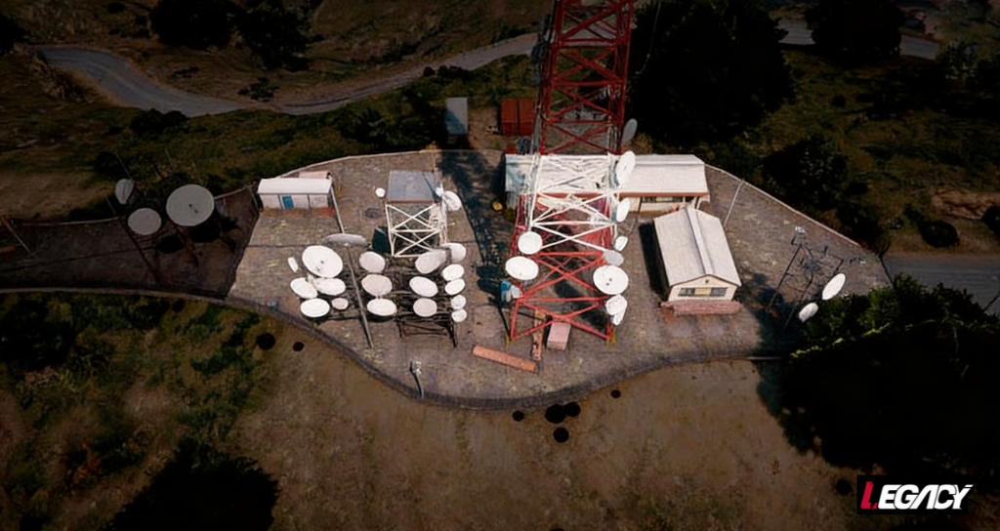
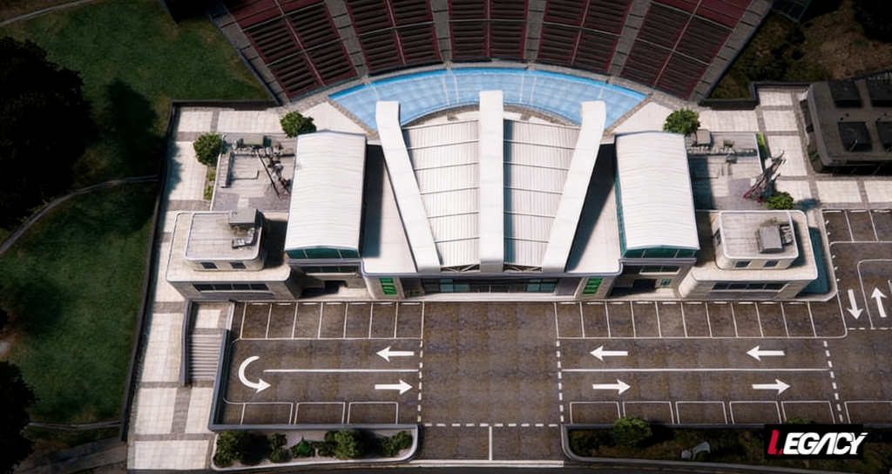

# 🔫Ações Pequenas

## Caixa Eletrônico, Corrida Ilegal e Roubo a Residência

Não é permitido nenhum tipo de resgate com armas, somente outro veículo para continuar a fuga.

Caso o veículo seja trocado, a fuga deixará de ser limpa e a polícia tem permissão para elevar o código da ação.

> <mark style="background-color:yellow;">Em caso de capotamento e que o veículo do mesmo permaneça capotado, a fuga dará continuidade "a pé", entretanto se o mesmo ainda não tiver trocado de veículo poderá ser resgatado, respeitando as OBSERVAÇÕES anteriores.</mark>

Caso o cidadão permaneça no interior do veículo capotado, o policial poderá retirar o mesmo.


**Refém: Proibido.**
\
**Armamento: Proibido.**


* [x] Negociação: Inexistente.
* [x] Bandidos: 1 Veículo cheio.
* [x] Policiais: 3 Viaturas.

***

## Aeroporto Trevor

<mark style="background-color:$warning;">**Negociação: Inexistente.**</mark>


**Regras Bandidos:** 5 membros

**Polícia:** 7 membros.


• Armamento: Pistola
\
• É Proibida a utilização de Smokes\
• **Teti-Chão: Sim**


**Reféns: Não permitido.**

**É proibido realizar a ação no modo de fuga.**

É proibido marcar o drop policial.

É obrigatório que o Drop dos policiais seja realizado na área demarcada em verde.

O perímetro delimitado deve ser rigorosamente respeitado.


<mark style="color:$warning;">É obrigatório aguardar a polícia por 30 minutos e, após o envio do QTI, é obrigatório permanecer no local até a chegada da polícia.</mark>

<figure><figcaption></figcaption></figure>

***

## Ammunation Porto

<mark style="background-color:$warning;">**Negociação: Inexistente.**</mark>


**Regras Bandidos:** Mínimo 2 e Máximo 3 membros.

**Polícia:** 4 membros.


• Armamento: Pistola
\
• É Proibida a utilização de Smokes\
• **Teti-Chão: Sim**


**Reféns: Não permitido.**

**É proibido realizar a ação no modo de fuga.**

É proibido marcar o drop policial.

O perímetro delimitado deve ser rigorosamente respeitado.


<mark style="color:$warning;">É obrigatório aguardar a polícia por 30 minutos e, após o envio do QTI, é obrigatório permanecer no local até a chegada da polícia.</mark>

<figure><figcaption></figcaption></figure>

***

## Ammunation Praça

<mark style="background-color:$warning;">**Negociação: Inexistente.**</mark>


**Regras Bandidos:** Mínimo 2 e Máximo 3 membros.

**Polícia: 4** membros.


• Armamento: Pistola
\
• É Proibida a utilização de Smokes\
• **Teti-Chão: Sim**


**Reféns: Não permitido.**

**É proibido realizar a ação no modo de fuga.**

É proibido marcar o drop policial.

O perímetro delimitado deve ser rigorosamente respeitado.


<mark style="color:$warning;">É obrigatório aguardar a polícia por 30 minutos e, após o envio do QTI, é obrigatório permanecer no local até a chegada da polícia.</mark>

<figure><figcaption></figcaption></figure>

***

## Antena

<mark style="background-color:$warning;">**Negociação: Inexistente.**</mark>


**Regras Bandidos:** Mínimo 2 e Máximo 3 membros.

**Polícia: 4** membros.


• Armamento: Pistola
\
• É Proibida a utilização de Smokes\
• **Teti-Chão: Sim**


**Reféns: Não permitido.**

**É proibido realizar a ação no modo de fuga.**

É proibido marcar o drop policial.

O perímetro delimitado deve ser rigorosamente respeitado.


<mark style="color:$warning;">É obrigatório aguardar a polícia por 30 minutos e, após o envio do QTI, é obrigatório permanecer no local até a chegada da polícia.</mark>

<figure><figcaption></figcaption></figure>

***

## Auditório

<mark style="background-color:$warning;">**Negociação: Inexistente.**</mark>


**Regras Bandidos:** 5 membros.

**Polícia: 7** membros.


• Armamento: Pistola
\
• É Proibida a utilização de Smokes\
• **Teti-Chão: Sim**


**Reféns: Não permitido.**

**É proibido realizar a ação no modo de fuga.**

É proibido marcar o drop policial.

O perímetro delimitado deve ser rigorosamente respeitado.


<mark style="color:$warning;">É obrigatório aguardar a polícia por 30 minutos e, após o envio do QTI, é obrigatório permanecer no local até a chegada da polícia.</mark>

<figure><figcaption></figcaption></figure>

***

